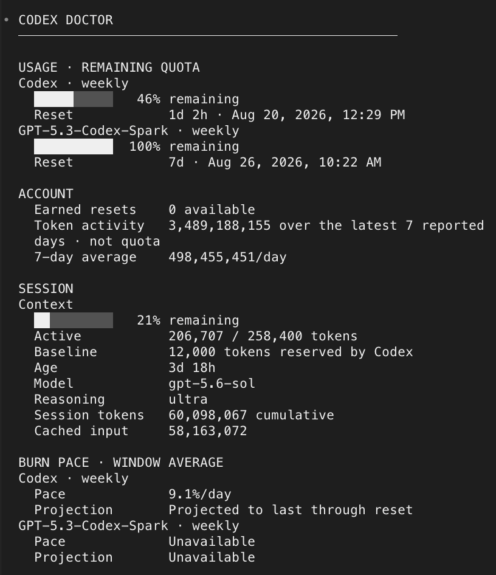

# Codex Doctor

[](https://github.com/boaz-hwang/codex-doctor/actions/workflows/test.yml)
[](LICENSE)

Codex Doctor is a local, read-only Codex skill that explains quota windows, context pressure, session age, token activity, and burn pace—then recommends the next action supported by the available evidence.



## What it reports

- Every quota bucket and window returned by Codex, without assuming a fixed 5-hour or weekly layout.
- Remaining quota as a fixed-width horizontal meter, plus reset times and window-average burn projections.
- Active context pressure with the same remaining-capacity meter and Codex's current-session token snapshot.
- Session age, active model, reasoning level, and cumulative session token activity.
- Explicitly scoped recommendations that keep unavailable data unavailable.

Codex Doctor uses the official Codex app-server account APIs first and falls back only to a recent snapshot from the active local session. Account token activity is labeled separately from quota consumption.

## Install the skill

Until the plugin is available in the universal Plugins Directory, install the standalone skill from this repository:

```bash
git clone https://github.com/boaz-hwang/codex-doctor.git "$HOME/.local/share/codex-doctor"
mkdir -p "$HOME/.agents/skills"
ln -s "$HOME/.local/share/codex-doctor/skills/codex-doctor" "$HOME/.agents/skills/codex-doctor"
```

Start a new Codex conversation after installation so the skill is discovered.

## Use it

Ask Codex:

```text
$codex-doctor How much usage do I have left, and should I keep this session?
```

You can also run the collector directly:

```bash
node skills/codex-doctor/scripts/codex-doctor.mjs
node skills/codex-doctor/scripts/codex-doctor.mjs --json
```

Requirements:

- Node.js 18 or newer.
- A signed-in Codex CLI with app-server support.
- An active Codex turn for session-specific fields; account limits can still be reported without one.

## Test

```bash
node --test skills/codex-doctor/scripts/codex-doctor.test.mjs
python3 "$CODEX_HOME/skills/.system/skill-creator/scripts/quick_validate.py" skills/codex-doctor
```

The second command uses Codex's built-in skill validator when it is available.

## Data and privacy

The plugin has no developer-operated server, analytics, or telemetry. It uses your existing local Codex authentication through app-server and does not retain or output credentials or conversation content. See [PRIVACY.md](PRIVACY.md) for the exact data flow.

## OpenAI directory submission

This repository is packaged as a skills-only Codex plugin. The review-ready listing copy, starter prompts, test cases, and release notes are in [docs/submission.md](docs/submission.md).

Codex Doctor is an independent community project and is not affiliated with or endorsed by OpenAI.

## Contributing

Issues and focused pull requests are welcome. Read [CONTRIBUTING.md](CONTRIBUTING.md) before changing diagnosis thresholds, data-source precedence, or privacy behavior.

## License

[MIT](LICENSE) © 2026 Boaz Hwang
